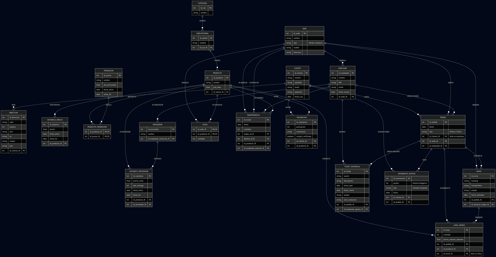

# Nombre Alumno: José Javier Díaz Blázquez

## Explicacion de la empresa modelada
NexShop es básicamente una empresa de retail que vende el mismo catálogo en su web y en sus tres tiendas de Madrid, Barcelona y Valencia. Aunque cada canal va un poco a su bola con su propio equipo, la central de Valencia maneja todo el cotarro: coordina la logística, cambia los precios y ofertas al vuelo, y lidia con los proveedores para conseguir las mejores condiciones.

## Instrucciones para importar la base de datos y ejecutar las consultas.
 1. Abre tu entorno de gestión de bases de datos.
 2. Abrir una nueva pestaña de consultas.
 3. Copia todo el contenido del script schema.sql y pégalo en tu editor.
 4. Una vez creada las tablas, repetiremos el mismo paso 2 y 3 para el script de datos para popular las tablas con datos de prueba.
 5. Repetir paso 2 y ir lanzado 1 a 1 las consultas del script consultas.sql (importante que las tablas hayan sido rellenadas con los datos de prueba, si no no va a funcionar)

## Captura diagrama ER.

 

